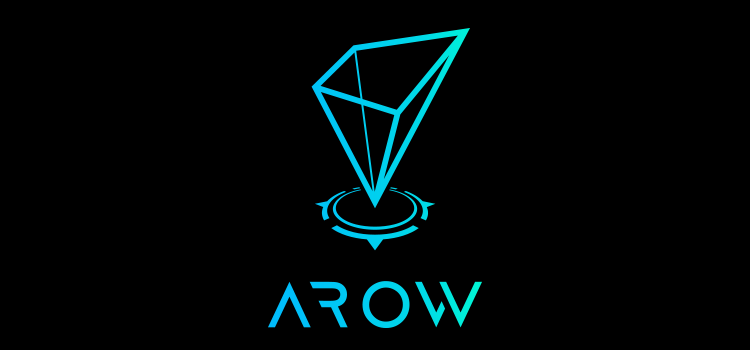

# アニマルランランド

## 概要

3DリアルマップとPOIデータを活用するプラットフォーム 「AROW」 の前身となった SDK が組み込まれたアプリ
「アニマルランランド」の公開ソースコードです。

### 「アニマルランランド」のアプリ説明


知っている街が遊園地になる！アニマルカーを操作し、街を走り回ってスコアを競い合うランゲームです。学校や交番などを通ると制限時間が回復します！自分が知っている街を走り回って、エリアのトップスコアを目指しましょう！

- アプリストアリンク
  - iOS: https://itunes.apple.com/jp/app/id1445978180?mt=8
  - Android: https://play.google.com/store/apps/details?id=jp.co.drecom.ARL

### AROWの説明



「AROW」 とは3DリアルマップとPOIデータを活用するプラットフォームです。

- AROW の公式リンク
  - AROW: https://arow.world/
  - facebook AROW ページ: https://www.facebook.com/AROW-266389430650623/
  - facebook AROW 開発者グループ「AROW 相談所」: https://www.facebook.com/groups/arow.developer.poi


# アニマルランランドゲーム起動ガイド

アニマルランランドのゲーム起動には Unity のほかに、ゲームサーバの用意とマップデータの用意が必要になります。

## 動作確認環境

- Mac OS X 10.14.3
- Unity 2017.4.5f1
- Docker 18.09.2

## ゲームサーバの用意

アニマルランランドで利用するゲームサーバを起動します。

以下は Docker を利用する場合の起動コマンドです。

```
cd app/server

docker-compose up -d --build

docker-compose exec game bash -c "./redis-5.0.3/src/redis-server ./redis.conf && mix ecto.create && mix ecto.migrate"
```

成功すると http://localhost:3000 でゲームサーバが立ち上がります。

## マップデータの用意

アニマルランランドで利用するマップデータを展開します。このマップデータはおよそ東京都/神奈川県全域とその周辺（経度 35〜36度,緯度 139〜140度）のデータを含みます。

```
cd app/client/Liver
unzip MapData1.zip
unzip MapData2.zip
unzip MapData3.zip
```

## Unity プロジェクトの起動

- app/client/Liver のUnity プロジェクトを開きます。
- Unityのメニューから「Arow」→「Local Server」→「LaunchServer」をクリックします。マップデータの配信サーバを起動するため、ネットワークの許可を求められます。
- 「Assets/Application/Scenes/Title.unity」のシーンを開きます。


# AROWサンプルアプリケーション「アニマルランランド」ライセンス

## AROWサンプルアプリケーション「アニマルランランド」をご利用いただく前に

- AROWサンプルアプリケーションをご利用いただく前に本ライセンスに関する内容をご確認ください。
- AROWサンプルアプリケーション「アニマルランランド」のソースコードダウンロードおよび利用を持って、このライセンスに同意したものとみなします。


## 前提条件

- AROWサンプルアプリケーション「アニマルランランド」のソースコード等に関して、その利用に際し、著作権使用料その他の利用料を請求することはありません。
- AROWサンプルアプリケーション「アニマルランランド」のソースコードあるいは素材を利用したアプリをリリースする際は、AROWサンプルアプリケーション「アニマルランランド」を使用している旨の表示を行ってください。
- AROWサンプルアプリケーション「アニマルランランド」で使用しているOSMに基づくマップデータについては、OSMのライセンスの下で提供されます。


## 許可

- 当ライセンスの制定した条件に則す場合に限り、商用・非商用・個人・法人を問わず、本ソースコードを利用することができます。
- AROWサンプルアプリケーション「アニマルランランド」のソースコードおよび素材は、加工・編集を行うことができます。
- AROWサンプルアプリケーション「アニマルランランド」のソースコードおよび素材は公開終了以降も当ライセンスに基づいて利用することができます。


## 禁止事項
- ソースコードおよび素材を法令（日本国内法）に抵触する制作物・コンテンツで使用すること。
- ソースコードおよび素材を公序良俗に反する制作物・コンテンツで使用すること。
- ソースコードおよび素材を二次配布すること。
- 弊社の名誉や信用を毀損し、または既存するおそれがあると判断される用途で使用すること。

## 免責事項
- ソースコードおよび素材の利用に際し、いかなるトラブルが発生しても当社は一切の責任を負いません。
- ソースコードおよび素材は予告なしに変更・削除される場合があります。
- 本ライセンスは予告なく改定される場合があります。

